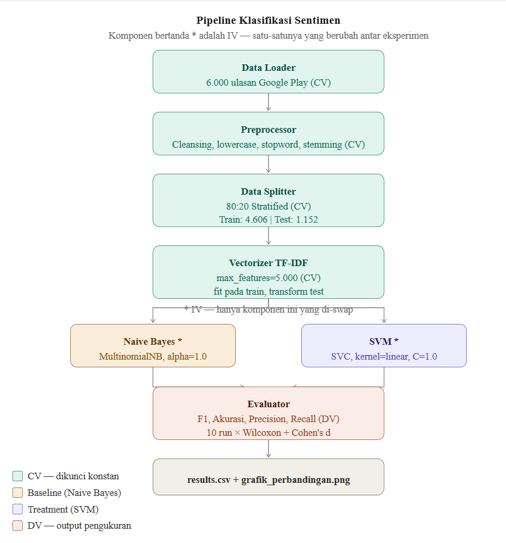

# Arsitektur dan Skema Eksperimen

Dokumen ini menjelaskan arsitektur pipeline klasifikasi sentimen, alur eksperimen, struktur data, dan pemetaan ke implementasi kode notebook.

---

## 1. Arsitektur Pipeline Klasifikasi Sentimen


*Gambar 1. Arsitektur Pipeline Klasifikasi Sentimen NB vs SVM*

Pipeline terdiri dari lima komponen modular yang masing-masing terhubung langsung ke variabel penelitian:

| Komponen | Fungsi | Peran Variabel | Cell Notebook |
|----------|--------|----------------|---------------|
| Data Loader | Memuat CSV 6.000 ulasan 3 aplikasi | CV — tidak berubah antar kondisi | Cell 3–7 |
| Preprocessor | Lowercase, hapus simbol, stopword removal, stemming PySastrawi | CV — tidak berubah antar kondisi | Cell 9–11 |
| Vectorizer TF-IDF | Mengubah teks ke vektor numerik max_features=5.000 | CV — tidak berubah antar kondisi | Cell 13 |
| Classifier | MultinomialNB atau SVC — di-swap via config | IV — satu-satunya yang berubah | Cell 14–15 |
| Evaluator | Menghitung F1, Akurasi, Precision, Recall, simpan ke CSV | DV — output pengukuran | Cell 16–19 |

---

## 2. Alur Eksperimen

1. **Scraping Google Play Store** — BCA Mobile + Mandiri Online + BRImo, ±2.000 ulasan per aplikasi
2. **Labeling otomatis** dari rating bintang — positif (4–5★), netral (3★), negatif (1–2★)
3. **Preprocessing** — lowercase → hapus simbol/angka/emoji → stopword removal → stemming PySastrawi
4. **TF-IDF Vectorizer** — max_features=5.000, fit hanya pada training set untuk mencegah data leakage
5. **Split 80:20 stratified** — random_state berbeda tiap run
6. **Kondisi A & B dijalankan paralel:**
   - Kondisi A: MultinomialNB (alpha=1.0)
   - Kondisi B: SVC linear (kernel=linear, C=1.0)
7. **Evaluasi** — F1-Score, Akurasi, Precision, Recall per kondisi
8. **Diulang 10 run** dengan random_state=0–9
9. **Analisis statistik** — Wilcoxon signed-rank test + Cohen's d
10. **Output** — results.csv + grafik_perbandingan.png

---

## 3. Struktur Data

### 3.1 Dataset Mentah — `dataset_ulasan_banking.csv`

| Kolom | Tipe | Deskripsi |
|-------|------|-----------|
| nama_user | string | Nama pengguna Google Play Store |
| ulasan | string | Teks ulasan berbahasa Indonesia |
| rating | integer | Rating bintang (1–5) |
| tanggal | datetime | Tanggal ulasan ditulis |
| aplikasi | string | Nama aplikasi (BCA Mobile / Mandiri Online / BRImo) |
| sentimen | string | Label otomatis: positif / netral / negatif |

**Distribusi:**
- Total: 6.000 ulasan (2.000 per aplikasi)
- Positif (4–5★): 4.184 (69,7%)
- Negatif (1–2★): 1.540 (25,7%)
- Netral (3★): 276 (4,6%)

### 3.2 Dataset Bersih — `dataset_bersih.csv`

Sama dengan dataset mentah + kolom tambahan:

| Kolom | Tipe | Deskripsi |
|-------|------|-----------|
| ulasan_bersih | string | Teks ulasan setelah preprocessing PySastrawi |

**Total setelah cleaning:** 5.758 ulasan valid (242 dihapus karena kosong setelah preprocessing)

### 3.3 Output Eksperimen

**`hasil_perbandingan.csv`** — hasil run tunggal (random_state=42):

| Kolom | Deskripsi |
|-------|-----------|
| model | Nama algoritma (NB / SVM) |
| f1_macro | F1-Score macro-average |
| accuracy | Akurasi |
| precision_macro | Precision macro-average |
| recall_macro | Recall macro-average |

**`hasil_statistik.csv`** — hasil 10 run:

| Kolom | Deskripsi |
|-------|-----------|
| run_id | ID run (0–9) |
| f1_nb | F1-Score NB pada run tersebut |
| f1_svm | F1-Score SVM pada run tersebut |

---

## 4. Pemetaan ke Implementasi Kode

| Tahap | Komponen | Cell Notebook | Library |
|-------|----------|---------------|---------|
| Setup | Install + import | Cell 1–2 | google-play-scraper, pandas, numpy, sklearn, nltk |
| Scraping | Data Loader | Cell 3–7 | google-play-scraper |
| Preprocessing | Preprocessor | Cell 9–11 | PySastrawi, re |
| Vektorisasi | Vectorizer TF-IDF | Cell 13 | sklearn.feature_extraction.text.TfidfVectorizer |
| Training NB | Classifier (Kondisi A) | Cell 14 | sklearn.naive_bayes.MultinomialNB |
| Training SVM | Classifier (Kondisi B) | Cell 15 | sklearn.svm.SVC |
| Evaluasi | Evaluator | Cell 14–16 | sklearn.metrics.classification_report, f1_score |
| 10 Run | Evaluator | Cell 18 | sklearn, numpy |
| Analisis Statistik | Evaluator | Cell 19 | scipy.stats.wilcoxon, numpy |
| Output | Download | Cell 17, 20 | google.colab.files |

---

## 5. Konfigurasi Parameter

```python
# TF-IDF
max_features = 5000

# Split
test_size    = 0.2
stratify     = y
random_state = 42  # run tunggal
              # 0–9 untuk 10 run eksperimen

# Naive Bayes
alpha        = 1.0  # Laplace smoothing default

# SVM
kernel       = 'linear'
C            = 1.0
random_state = 42
```

---

## 6. Hasil Eksperimen

| Metrik | Naive Bayes | SVM | Pemenang |
|--------|-------------|-----|----------|
| F1-Score (run tunggal) | 0,5466 | 0,5553 | SVM ✅ |
| Akurasi (run tunggal) | 0,8385 | 0,8455 | SVM ✅ |
| Rata-rata F1 (10 run) | 0,5532 | 0,5627 | SVM ✅ |
| p-value Wilcoxon | — | — | 0,0039 (H₀ ditolak) |
| Cohen's d | — | — | 2,0479 (large effect) |