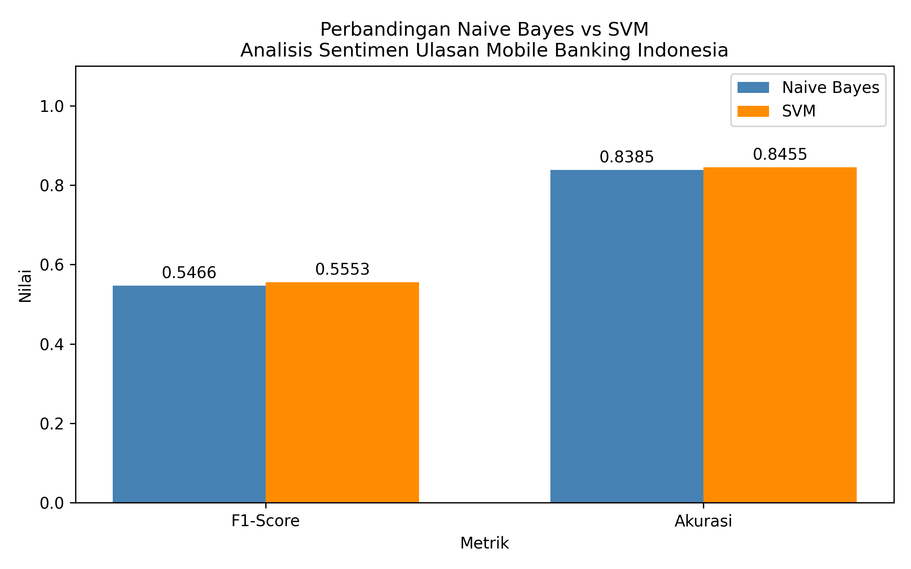

# 05-hasil-analisis.md — Hasil dan Pembahasan

## HASIL DAN PEMBAHASAN

### Hasil Eksperimen

Tabel 1 menyajikan hasil perbandingan run tunggal (random_state=42) dan Tabel 2 menyajikan hasil 10 run eksperimen.

Tabel 1. Hasil Perbandingan Run Tunggal (random_state=42)

| Algoritma | F1-Score | Akurasi |
|-----------|----------|---------|
| Naive Bayes | 0,5466 | 0,8385 |
| SVM | 0,5553 | 0,8455 |
| Selisih | +0,0087 | +0,0070 |

Tabel 2. Hasil F1-Score Macro-Average dari 10 Run Eksperimen

| Run | F1 Naive Bayes | F1 SVM |
|-----|----------------|--------|
| 1 | 0,5542 | 0,5601 |
| 2 | 0,5578 | 0,5691 |
| 3 | 0,5460 | 0,5541 |
| 4 | 0,5599 | 0,5595 |
| 5 | 0,5496 | 0,5617 |
| 6 | 0,5558 | 0,5648 |
| 7 | 0,5544 | 0,5666 |
| 8 | 0,5589 | 0,5671 |
| 9 | 0,5456 | 0,5643 |
| 10 | 0,5495 | 0,5594 |
| **Rata-rata** | **0,5532** | **0,5627** |
| **Std. Deviasi** | **0,0052** | **0,0045** |

SVM menghasilkan F1-Score lebih tinggi pada 9 dari 10 run. Perbandingan visual ditunjukkan pada Gambar 2.

Gambar 2. Perbandingan F1-Score dan Akurasi Naive Bayes vs SVM

### Analisis Statistik

Tabel 3. Hasil Analisis Statistik

| Parameter | Nilai | Interpretasi |
|-----------|-------|-------------|
| p-value (Wilcoxon) | 0,0039 | p < α = 0,05 → H₀ ditolak |
| Cohen's d | 1,9428 | Large effect (d > 0,8) |

Nilai p = 0,0039 < α = 0,05 menunjukkan perbedaan F1-Score antara SVM dan Naive Bayes signifikan secara statistik sehingga H₀ ditolak dan H₁ diterima. Cohen's d = 1,9428 mengindikasikan large effect yang bermakna secara praktis.

### Pembahasan

Hasil penelitian ini konsisten dengan temuan studi sebelumnya yang menunjukkan keunggulan SVM atas Naive Bayes pada analisis sentimen teks Indonesia (Ningsih et al., 2024; Khaira et al., 2023; Andrian et al., 2022). Keunggulan SVM dapat dijelaskan oleh kemampuannya mencari hyperplane optimal di ruang dimensi tinggi representasi TF-IDF (Cortes & Vapnik, 1995), sehingga lebih robust terhadap noise pada ulasan berbahasa Indonesia yang mengandung singkatan tidak baku dan campur kode. Nilai F1-Score yang moderat mencerminkan tantangan distribusi kelas yang tidak seimbang — positif 69,7% berbanding netral 4,6%. Nilai akurasi yang relatif tinggi dibandingkan F1-Score mengkonfirmasi bias akibat class imbalance, memvalidasi pemilihan F1-Score macro-average sebagai metrik primer (Andrian et al., 2022). Effect size besar (Cohen's d = 1,9428) membuktikan perbedaan antara NB dan SVM konsisten dan bermakna secara praktis, bukan sekadar noise dari partisi data.

Penelitian ini berkontribusi mengisi gap metodologis yang teridentifikasi dari systematic literature review — ketiadaan perbandingan NB vs SVM dengan kondisi eksperimen identik pada dataset multi-bank ulasan mobile banking berbahasa Indonesia yang disertai uji statistik. Berbeda dari studi sebelumnya yang hanya membandingkan angka akurasi secara deskriptif (Edwina & Mauritsius, 2024; Samudera et al., 2024; Al Hakim & Irwiensyah, 2024), penelitian ini membuktikan bahwa perbedaan performa antara SVM dan Naive Bayes bukan sekadar noise melainkan perbedaan nyata yang dapat dipertanggungjawabkan secara ilmiah.